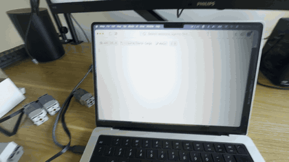

# bare-lego

Drive a LEGO Technic Hub over Bluetooth Low Energy from Bare.



A proof of concept: [`bare-bluetooth`](https://github.com/holepunchto/bare-bluetooth) connects to the hub of a LEGO Technic set (tested with 42160) and drives its motors with [`bare-lwp3`](https://github.com/tonygo/bare-lwp3), a codec for the [LEGO Wireless Protocol 3](https://lego.github.io/lego-ble-wireless-protocol-docs/). No firmware changes, no app, just Bare.

```
npm install
```

## Usage

Turn on the hub with its green button (the LED blinks while it advertises), then:

```
npm start
```

The CLI connects to the hub, calibrates the steering (the front wheels sweep to both ends to find the center), and stays connected so the hub never powers itself off during a session. Key bindings:

```
up     drive forward
down   drive backward
left   steer left
right  steer right
space  stop and center
q      quit and switch the hub off
```

On startup the CLI prints the battery level and refuses to start if a motor is missing on ports A, B or D. The hub LED shows the state: green ready, blue driving, red braking.

On first run macOS will ask for Bluetooth permission for your terminal.

## Web remote

```
npm run remote
```

Same connection and calibration, but instead of the keyboard the process serves a touch remote over HTTP. Open the printed URL on a phone on the same wifi: a pad with FWD / REV / LEFT / RIGHT / STOP, plus a power-off button. One Bare process speaks BLE to the car and HTTP to the phone.

## How it works

The hub exposes a single GATT characteristic (`00001624-1212-efde-1623-785feabcd123`). Every command is a small binary message written to it without response. Spinning a motor is 9 bytes: a Port Output Command (`0x81`) with the StartSpeed subcommand (`0x07`), the port id, and the speed.

## License

Apache-2.0
